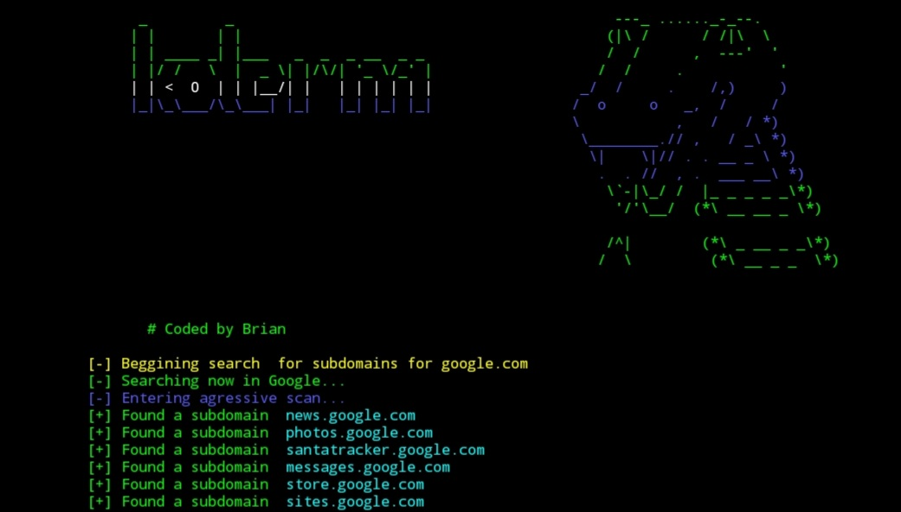

<h2>Koterm</h2>
Koterm is a fast subdomain enumerator and host scanning tool I wrote in python .

It is designed for websites which use OSINT. May be of great use in bug bounty programs.



<h3>Installation</h3>
Clone from koterm github repo

```
git clone https://github.com/Brian254ke/koterm.git
```

<b>Optional (Linux or Unix like terminal emulators):</b> Navigate to the directory where you have cloned the koterm repo then add execute permission to the koterm.py script

```
chmod +x koterm.py
```

Now we wont need to include the name python when running the script.
we will simply use <br>

```
./koterm.py { do something}
```

 instead of

```
python koterm.py { do something}
```


It is a bit shotter

<h3>Requirements</h3>
Koterm requires Python versions  3.x.x and above.

It depends on the following modules : requests module , argparse and colorama (coloring windows) not in standard library .
To install the required modules simply run the following command.

```
pip install -r requirements.txt
```

or alternatively

```
python -m pip install -r requirements.txt
```

<h3>Usage</h3>
You need to memorize only a few flags to pass in arguments.

| Short | Full       | Use                                                              |
| ----- | ---------- | ---------------------------------------------------------------- |
| -h    | -help      | dislay usage and help menu                                       |
| -d    | -domain    | pass in a domain for the search                                  |
| -t    | -target    | target ip or host name for port scanning                         |
| -o    | -output    | save output to a file                                            |
| -p    | -ports     | several ports to be scanned separated by a comma                 |
| -pr   | -portrange | scan a range of port numbers. Given in pair separated by a comma |
| -v    | -verbose   | disable verbose option                                           |
| -c    | -color     | disable coloring                                                 |

<b>Usage example</b>

You can run the koterm script with ./ only if the script has execute permission.<br>Use python {args comes here} alternatively to run the script

> ./koterm.py -d google.com

> ./koterm.py -d twitter.com -o test.txt

> ./koterm.py -d example.com -v "off"

> ./koterm.py -d google.com -p 22,80,443

> ./koterm.py -d google.com -pr 22,1024 -o sub.txt -v dis

> ./koterm.py -d yahoo.com -c "off"

> ./koterm.py -t example.com -p 1,2,3

> ./koterm.py -t 10.10.10.1 -pr 10,1024

> ./koterm.py -t 198.12.12.1 -p 22 -c off -v dis

<h3>Thank You !</h3>

Open for contributions.

I give credit to my friends from Orion group. Mike , Ian and Collins.  Thank you guys for the support .

Check out more interesting projects from our website . [orion](http://code.orionkenya.ml)

Thank you for visiting this page.


